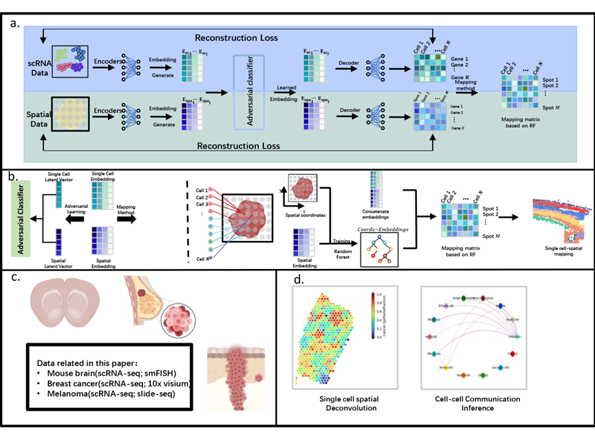

# SPCC: Inference of spatial intercellular communications through integration of single-cell and spatial transcriptomics by using unsupervised domain adaptation framework

Abstract: Study of single-cell spatial biology reveals the importance of integrating single-cell and spatial for capturing spatial structure in single-cell resolution with specific task, like tissue development or disease. With the limitation or gene throughput on spatial data, it is necessary to integrate single-cell and spatial data. Here we present a deep learning computational framework for alignment and mapping of the unpaired single-cell and the spatial data by using adversarial joint-variational autoencoder and Random Forest model (FADATC). FADATC will generate a mapping matrix for single-cell and spatial position, with the mapping matrix we can transfer spatial coordinates to single-cell data and finish downstream analysis based on pseudo-space information, such as cell-cell communication, spatial variable gene identification. We demonstrate our method performance on three biology datasets with different spatial sequencing platforms and prove FADATC outperforms previous study with robust to the sequencing noise. Then we used FADATC to the mouse somatosensory cortex，breast cancer and melanoma brain metastasis datasets to identify the spatial pattern of the cell-cell interaction. FADATC has successfully captured the precise spatial structure in the mouse brain and microenvironment within tumor tissue. We found that PECAM1, which rarely identified by using previous tools, shows potential contribution to SOX4. These results show that FADATC can identify unique spatial cell interactions with more sensitivity and accuracy.

  

# Usage  
Pretrain + RF mapping
> ./debug/debug_gimvi.py gives an example of using adversarial learning framework on mouse brain data for embedding learning.  

> ./debug/debug40.py gives an example of using adversarial learning framework on breast cancer data for embedding learning.

> ./debug/CRC_liver_metastasis/debug.py gives an example of using adversarial learning framework on emlanoma data for embedding learning.

